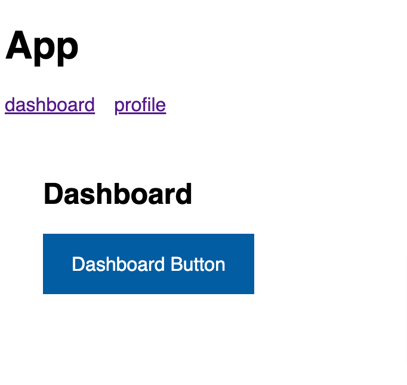
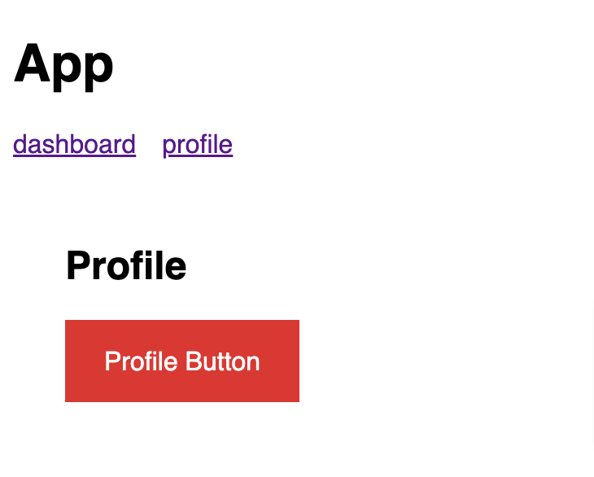
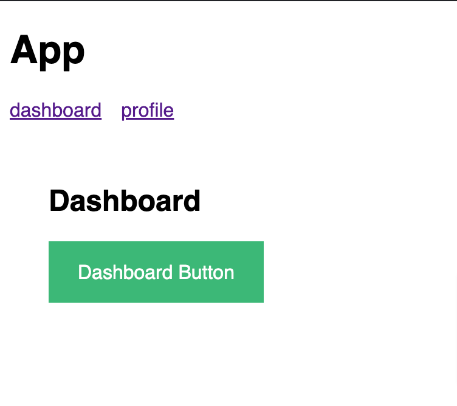

When creating Angular components for others to use someone will inevitably request the ability to customize styles that are not supported. While we could add an `Input` to override a style, this will almost always lead to configuration bloat. A better approach is to provide styling hooks for the CSS properties you wish to make customizable.

## What are CSS Custom Properties?

[CSS custom properties](https://developer.mozilla.org/en-US/docs/Web/CSS/Using_CSS_custom_properties), also known as **_CSS variables_**, are a way to assign a CSS value to an identifier, and then reference that value using the identifiers name.

CSS custom properties are created using the `--` prefix:

```css
:root {
  --background-primary: #f7f7f7;
}
```

CSS custom properties can then be accessed using the [`var()`](https://developer.mozilla.org/en-US/docs/Web/CSS/var) function.

```css
body {
  background-color: var(--background-primary);
}
```

The `var()` function also accepts a default value in cases where the custom property is not defined:

```css
main {
  background-color: var(--background-dark, #333);
}
```

Defining CSS custom properties using the `:root` selector will make them available to the entire document. It's possible to "scope" a CSS custom property to an element as well:

```css
main {
  --background-dark: #333;
  background-color: var(--background-dark);
}
```

We can leverage the ability to pass default values to the `var()` function with being able to "scope" CSS custom properties to an element to expose styling hooks for our Angular components.

```ts
import { Component } from '@angular/core'

@Component({
  selector: 'my-button',
  styles: [
    `
      button {
        all: unset;
        padding: 1em 1.5em;
        cursor: pointer;

        /* highlight-start */
        background: var(--button-bg, #005ea2);
        color: var(--button-color, #fff);
        /* highlight-end */
      }

      button:hover {
        /* highlight-start */
        background: var(--button-bg--hover, #1a4480);
        /* highlight-end */
      }

      button:active {
        /* highlight-start */
        background: var(--button-bg--active, #162e51);
        /* highlight-end */
      }
    `,
  ],
  template: `
    <button><ng-content></ng-content></button>
  `,
})
export class ButtonComponent {}
```

In our `ButtonComponent`, we use CSS custom properties (`--button-bg`, `--button-bg--hover`, and `--button-bg--active`) to define the `background` color for the different button states (default, hover, and active). Since we haven't defined any CSS custom properties yet we pass our default `background` color values to the `var()`.



With these style hooks in place, consumers of the `my-button` component are able to override the `background` color styles by setting their own values for the CSS custom properties we referenced (`--button-bg`, `--button-bg--hover`, and `--button-bg--active`).

```ts
import { Component } from '@angular/core'

@Component({
  selector: 'my-profile',
  styles: [
    `
      /* highlight-start */
      my-button {
        --button-bg: #d83933;
        --button-bg--hover: #b50909;
        --button-bg--active: #8b0a03;
      }
      /* highlight-end */
    `,
  ],
  template: `
    <div class="container">
      <h2>Profile</h2>
      <my-button>Profile Button</my-button>
    </div>
  `,
})
export class ProfileComponent {}
```



We can even leverage the CSS custom property styling hooks internally in our components for creating style variations:

```typescript:title=button.component.ts
import { Component } from '@angular/core'

@Component({
  selector: 'my-button',
  styles: [
    `
      button {
        all: unset;
        padding: 1em 1.5em;
        cursor: pointer;
        color: #fff;
        background: var(--button-bg, #005ea2);
      }

      button:hover {
        background: var(--button-bg--hover, #1a4480);
      }

      button:active {
        background: var(--button-bg--active, #162e51);
      }

      /* highlight-start */
      :host(.success) button {
        --button-bg: #3cb878;
        --button-bg--hover: #297e52;
        --button-bg--active: #16452d;
      }
      /* highlight-end */
    `,
  ],
  template: `
    <button><ng-content></ng-content></button>
  `,
})
export class ButtonComponent {}
```

Now consumers of our `my-button` component can change the style by using the `success` `class`:

```html:title=dashboard.component.html
<my-button class="success">Dashboard Button</my-button>
```



Or, we can create an abstraction for the `class` assignment using a `theme` `Input` instead. This is my preferred approach since it comes with the added benefit of editor intellisense:

```typescript:title=button.component.ts
import { Component, Input } from '@angular/core'

@Component({
  selector: 'my-button',
  styles: [
    `
      button {
        all: unset;
        padding: 1em 1.5em;
        cursor: pointer;
        color: #fff;
        background: var(--button-bg, #005ea2);
      }

      button:hover {
        background: var(--button-bg--hover, #1a4480);
      }

      button:active {
        background: var(--button-bg--active, #162e51);
      }

      /* highlight-start */
      button.success {
        --button-bg: #3cb878;
        --button-bg--hover: #297e52;
        --button-bg--active: #16452d;
      }
      /* highlight-end */
    `,
  ],
  template: `
    /* highlight-start */
    <button [ngClass]="theme">
      /* highlight-end */
      <ng-content></ng-content>
    </button>
  `,
})
export class ButtonComponent {
  /* highlight-start */
  @Input() theme: 'default' | 'success' | 'warn' = 'default'
  /* highlight-end */
}
```

Consumers can then pass a `theme` to get the styles they want:

```html:title=dashboard.component.html
<my-button theme="success">Themeable Button</my-button>
```

See example on [Stackblitz](https://stackblitz.com/edit/angular-ivy-ok5r1d?file=src/app/profile/profile.component.ts)

## Conclusion

Providing styling hooks for our Angular components using CSS custom properties allows us to make our components more flexible while still providing default styles.
