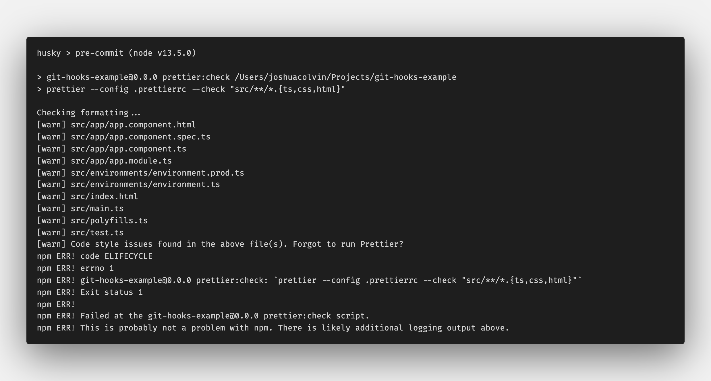

[Git hooks](https://git-scm.com/docs/githooks) allow you to trigger actions at certain points in git's execution. They are integral in keeping a codebase clean since we can do things like check code formatting, run linting, or run tests before code is committed or pushed to a remote repository.

## Prerequisites

Since we will be using npm packages you need to have [Node](https://nodejs.org/en/) and [npm](https://www.npmjs.com/) installed.

I will be using an [Angular](https://angular.io/) project generated with the [Angular CLI](https://angular.io/cli). If you don't have Angular CLI installed you can use the repository [here](https://github.com/joshuacolvin/git-hooks-example) as a starter.

## Helpful npm Packages

We will rely on a couple of npm packages that will help us set up git hooks.

The first package is [Husky](https://www.npmjs.com/package/husky) which lets you tie an [npm script](https://docs.npmjs.com/misc/scripts) or CLI command to a git hook in your `package.json` file.  We will only be looking at implementing a `pre-commit` and `pre-push` hook, although Husky does support all the git hooks defined in the git [documentation](https://git-scm.com/docs/githooks#_hooks).

The second package is [lint-staged](https://www.npmjs.com/package/lint-staged) that you can use to run linting against staged git files only. It's helpful to run git hooks only on files that you have changed and are trying to commit or push. Running git hooks on all files in a large codebase would be prohibitively slow.

## Installing Packages

We can install husky and lint-staged with the following command:

```shell
npm install husky lint-staged --save-dev
```

Note: husky version `4.2.5` and lint-staged version `10.2.13` were used at the time of writing.

### Prettier

We will use [Prettier](https://prettier.io/), a code formatter, to test our pre-commit git hook. We can install prettier by running the following command:

```shell
npm install prettier --save-dev
```

In addition to the prettier package, we also need to add a configuration file where we can set our desired formatting [options](https://prettier.io/docs/en/options.html)

Add a `.prettierrc` file to the root of your project and paste in the following config options:

```text:title=.prettierrc
{
    "tabWidth": 4,
    "singleQuote": true,
    "printWidth": 120,
    "bracketSpacing": true,
}
```

Lastly, add an npm script that will run prettier with the `--check` flag. This will let us know if we have files that have not been formatted.

```json:title=package.json
{
    "scripts": {
        ...
        /* highlight-start */
        "prettier:check": "prettier --config .prettierrc --check \"src/**/*.{ts,css,html}\""
        /* highlight-end */
    }
}
```

## Setting up git hooks in package.json

Let's start by adding a pre-commit hook that checks that our code was formatted using Prettier. We want our commit to fail if files are found that are not formatted.

We can set up our git hook by adding a Husky config object to the `package.json` file and declaring what npm script we want to run for the pre-commit hook. We will run the `prettier:check` script we added earlier.

```json:title=package.json
{
    ...
    "scripts": {
        ...
    },
    /* highlight-start */
    "husky": {
        "hooks": {
            "pre-commit": "npm run prettier:check"
        }
    }
    /* highlight-end */
}
```

Try committing the changes you made to the `package.json` file. Your commit will fail with output similar to this:



You may have noticed that we made changes to the `package.json` file, but our commit is failing because the files in the `src` directory were not formatted. We only want to run the pre-commit hook on staged files since these are files that we edited. Doing this will keep our pre-commit hook checks fast.

## Running git hooks only on staged files using lint-staged

We can use the lint-staged package to run our git hooks only on staged files. To do this, we add a `lint-staged` configuration object to our `package.json` file where we define what script we want to run on which files.

```json:title=package.json
{
    "scripts": {
        ...
        "prettier:check": "prettier --config .prettierrc --check \"src/**/*.{ts,css,html}\""
    },
    /* highlight-start */
    "lint-staged": {
        "src/**/*.{ts,css,html}": [
            "npm run prettier:check"
        ]
    },
    /* highlight-end */
    "husky": {
        ...
    }
}
```

Lastly, we need to update our husky pre-commit hook to run `lint-staged` instead of the prettier npm script:

```json:title=package.json
{
    "lint-staged": {
        "src/**/*.{ts,css,html}": [
            "npm run prettier:check"
        ]
    },
    "husky": {
        "hooks": {
            /* highlight-start */
            "pre-commit": "lint-staged"
            /* highlight-end */
        }
    }
}
```

Try committing the `package.json` file again. It should work this time. Now, make a change to a file in the `src` directory like `src/app/app.component.ts` and try committing that file. The commit should fail since Prettier wasn't used to format the file.

## Running tests on pre-push git hook

It's also a good idea to run unit tests before we push code to a remote repository. We can do this by setting up a pre-push git hook using Husky.

```json:title=package.json
{
    "husky": {
        "hooks": {
            "pre-commit": "lint-staged",
            /* highlight-start */
            "pre-push": "npm run test"
            /* highlight-end */
        }
    }
}
```

To test the pre-push hook we need to modify a unit test so that it fails. Open `src/app/app.component.spec.ts` and change line 16 from `expect(app).toBeTruthy();` to `expect(app).toBeFalsy();`.

Now try pushing your code to a remote repository. The push will fail because you have a failing test. Revert the change you made to the test and try pushing again. The push should succeed now.

## Conclusion

Using git hooks to check code quality is a great way to keep your codebase clean. I recommend that you use git hooks to check the formatting of all your code, run linting on your JavaScript/TypeScript and CSS/Sass, and run your tests. If we automate these checks we can be sure that they occur before code is committed or pushed.
