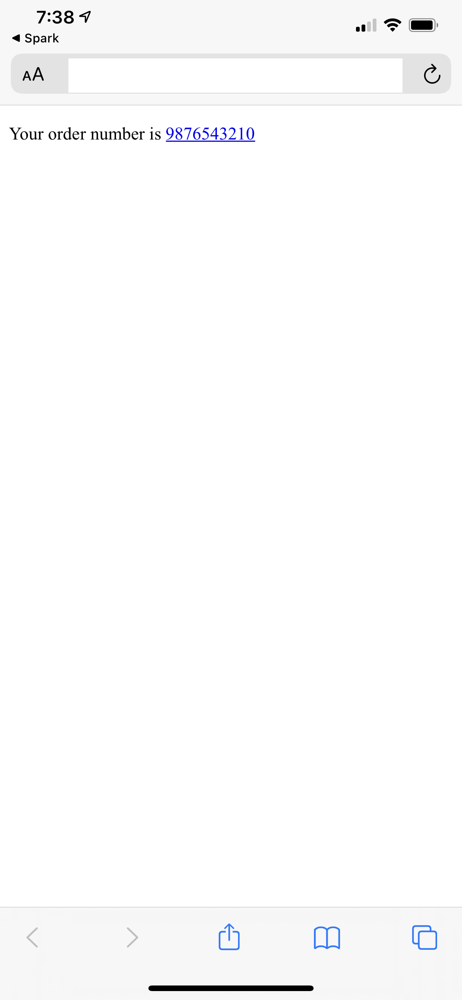
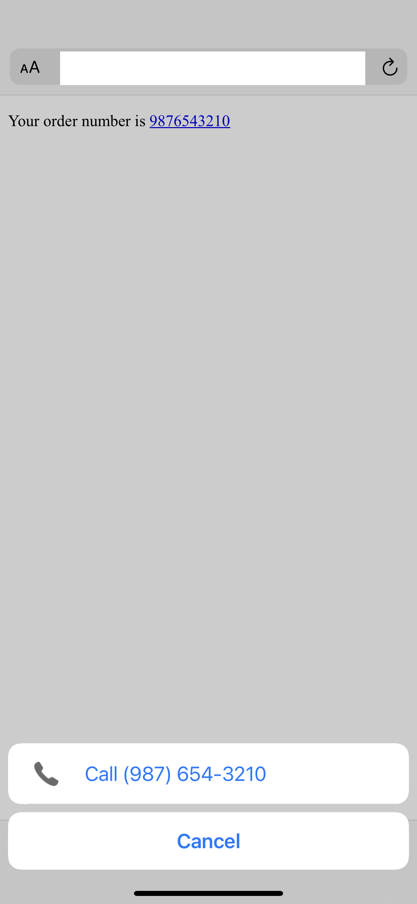

Safari on IOS has a handy feature that will automatically detect phone numbers and turn them into clickable links. Your site may contain numbers that Safari incorrectly interprets as phone numbers. This post will show you how to prevent this behavior.

## The Problem

If you are displaying numbers in an HTML file, such as order numbers, there is a chance that Safari on IOS will treat those numbers as a phone number.

```html
<p>Your order number is 9876543210</p>
```

If you open the html file in Safari on IOS you can see that Safari has turned the number into a link even though it is just a number inside of a `p` tag and there is no `a` tag in sight.



If we click the link it will open the "call" menu which is helpful for actual phone numbers but not in this case.



## Solution

We can prevent Safari's phone number detection by adding the `meta` tag below.

```html
<head>
  <meta name="format-detection" content="telephone=no" />
</head>
```

This tells Safari not to do any phone number detection.

What if we have have actual phone numbers that we want detected?

## Selectively Detecting Phone Numbers

If we have phone numbers that we want to be "clickable" we should use an `href` with the `tel:` url scheme.

```html
<a href="tel:123-456-7890">(123) 456-7890</a>
```

This will give us the desired behavior for phone numbers while preventing non-phone numbers from being turned into links.
